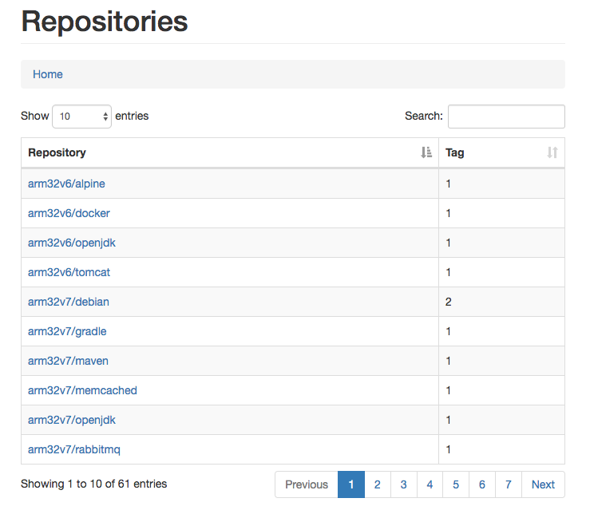
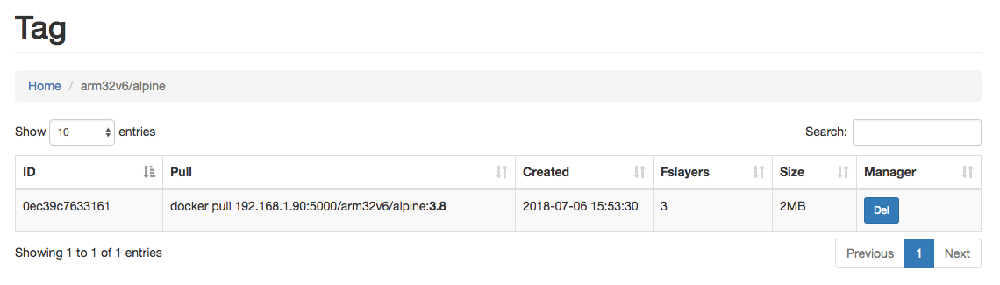
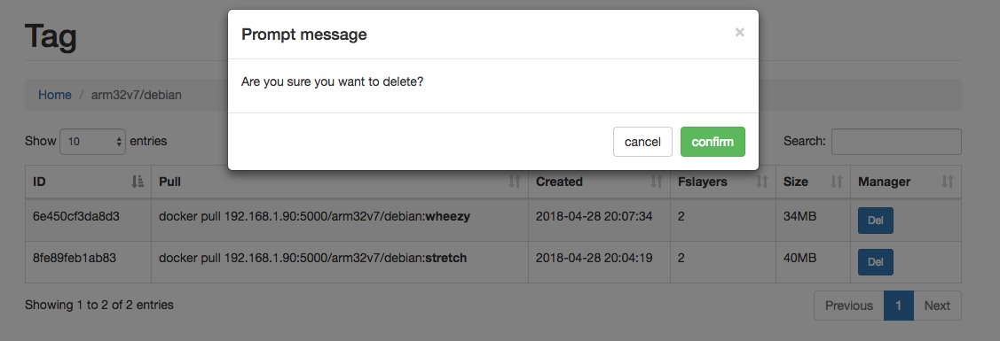

1.install registry

quick run registry if arm please use `budry/registry-arm:2.6.2`

```yaml
version: '3'

services:
  registry:
    image: budry/registry-arm:2.6.2
    container_name: registry
    ports:
      - "5000:5000"
    volumes:
      - /data/cubieboard/registry:/var/lib/registry
      - ./config.yml:/etc/docker/registry/config.yml
    environment:
      - REGISTRY_STORAGE_DELETE_ENABLED:true
```

```yaml
version: 0.1
log:
  fields:
    service: registry
storage:
  cache:
    blobdescriptor: inmemory
  filesystem:
    rootdirectory: /var/lib/registry
  delete:
    # must set true when delete image
    enabled: true

http:
  addr: :5000
  headers:
    X-Content-Type-Options: [nosniff]
health:
  storagedriver:
    enabled: true
    interval: 10s
    threshold: 3
```

2.install registry-ui

image: `clibing/armhf-docker-registry-ui:version`

quick install and run

```yaml
version: '3.5'

services:
  registry-ui:
    image: clibing/armhf-docker-registry-ui:20180725105902
    ports:
      - 8080:8080
    environment:
      - HOST=192.168.1.90
      - PORT=5000
      - USER=admin
      - PASSWD=123456
```

3.view web

main:



tags:



delete



4.registry garbage gc

the `registry-gc.sh`shell

```bash
#!/usr/bin/env bash
# date    : 2018-07-25 11:56
# email   : wmsjhappy@gmail.com
# author  : clibing
# function: registry garbage gc support --dry-run
#           dry-run
# github  : https://github.com/clibing/dockerfile/tree/master/shell
set -e

CONTAINER_NAME=${CONTAINER_NAME:-"registry"}
REGISTRY_CONFIG=${REGISTRY_CONFIG:-"/etc/docker/registry/config.yml"}
DRY_RUN=${DRY_RUN:-"false"}

while getopts "n:r:d:" OPT; do
    case $OPT in
        n)
            CONTAINER_NAME=$OPTARG;;
        r)
            REGISTRY_CONFIG=$OPTARG;;
        d)
            DRY_RUN=$OPTARG;;
    esac
done

if [ "$DRY_RUN" == "true" ];then
        COMMAND="registry garbage-collect ${REGISTRY_CONFIG}"
else
        COMMAND="registry garbage-collect -d ${REGISTRY_CONFIG}"
fi

docker exec ${CONTAINER_NAME} ${COMMAND}
```

description:

./registry-gc.sh -n docker-registry-container_name -r /etc/docker/registry/config.yml